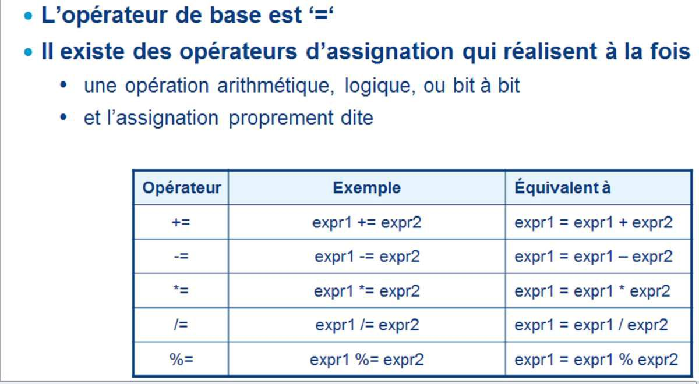
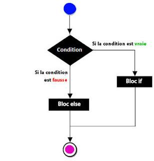
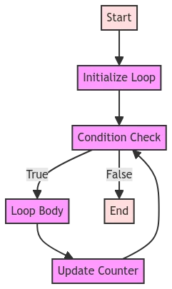

# day 1 Daily Java Drip(DJD)
## Objectif Global:
Ce cours fait partie d'un ensemble d'une séance de de cours sur le angage JAVA et qui va me permettre de réviser les base du langage.
Je partagerai quotidiennement les différentes parties de cette séance.
### Objectif du jour
Pour le jour 1 nous avons vu:
 - Les différents types de variable(int, float, bool etc)

 - Les opérateurs d'affectations

 - Les structures conditionnelles

 - Les structures répétitives

   
On utilise la boucle:
## for: 
Quand on connait le nombre d'ittération. 
## while 
Quand on ne connait pas le nombre d'ittération. While effectue la vérification de la condition avant d'exécuter le programme. 
## do...while 
Quand on ne connait pas le nombre d'ittération et qu'on veut exécuter d'abord le programme avant d'effectuer une vérification de la condition.
La différence entre while et do...while est que avec while on peut ne pas exécuter le programme une fois que la condition est vraie dès le début et quant à do...while le programme est exécuté au moins une fois avant de faire la vérification.

